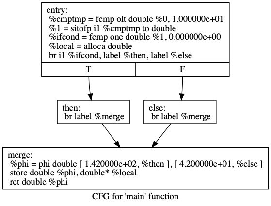

# Practice 7 条件分岐の実装

いよいよこのワークショップも大詰めです。

MinSwiftをより実用的にするため、`if`, `else`構文を実装してみましょう。
この章ではASTのパースからIRの生成までを一気に扱います。

## 7-1. 比較演算のパース

Practice 3では、四則演算のオペレータを扱いました。
今回は同様に比較演算子を追加します。比較も四則演算と同様に、`BinaryExpressionNode`を用いて表現します。


`ASTNode.swift`の`BinaryExpressionNode.Operator`に`lessThan`(`<`)を追加してみましょう。

オペレータを追加するためには、優先順位を適切に設定する必要があります。
以前扱った話を思い出して、適切な順位を設定してみてください。

余裕があれば`<=`, `==`, `>`など、他のオペレーターも追加してみてください。

## 7-2. if~else文のパース

実はここで新たに教えることはありません。今までの実装を思い出して、`parseIfElse`を実装してみましょう。

簡単のため、今回は全てのif文は必ず`else`ブロックを実装していると考えます。

## 7-3. 比較演算のIRを生成する

`Generator<BinaryExpressionNode>` に比較演算のIR生成を実装してみましょう。

```llvm
result = fcmp <cond> <type> <op1>, <op2>
```

`cond`は

resultは`i1`として取得できます。
`<cond>`の値は比較条件です。以下の値が使えます。

https://llvm.org/docs/LangRef.html#id305


LLVM Swiftでこのコードを記述すると、以下のようになります。


```swift
let bool = context.builder.buildFCmp(lhs, rhs, .orderedLessThan, name: "cmptmp")
return context.builder.buildIntToFP(bool, type: FloatType.double, signed: true)
```

2行目の`IntToFP`はLLVM IRにおける型のキャストです。
MinSwiftでは全ての値を`double`として扱っているため、`i1`から`double`へのキャストが必要になります。

```llvm
define double @main(double) {
entry:
  %cmptmp = fcmp olt double %0, 1.000000e+01
  %1 = sitofp i1 %cmptmp to double
  ret double %1
}
```

## 7-4. if文のIRを生成する

ここからが本番です。 ifブロックのIRを生成してみましょう。

### brとφ関数

```console
$ opt -S ifelse.ll -dot-cfg
$ dot -Tpng cfg.ifelse.dot -o ifelse.png
$ open ifelse.png
```

TBD

### Generatorの実装

今説明した知識を元に、IRを生成してみましょう！

適宜省略してありますので、`Node`から必要な値を取得するようにしてください。

例えば、以下のSwiftのコードからIRを生成してみます。
（このコード自体には何の意味もありません。サンプルを作るときに困っただけです）


```swift
func main(a: Double) -> Double {
    if a < 10 {
        return 42
    } else {
        return 142
    }
}
```

出力されるIRはこのようになります。

```llvm
; ModuleID = 'main'
source_filename = "main"

define double @main(double) {
entry:
  %cmptmp = fcmp olt double %0, 1.000000e+01
  %1 = sitofp i1 %cmptmp to double
  %ifcond = fcmp one double %1, 0.000000e+00
  %local = alloca double
  br i1 %ifcond, label %then, label %else

then:                                             ; preds = %entry
  br label %merge

else:                                             ; preds = %entry
  br label %merge

merge:                                            ; preds = %else, %then
  %phi = phi double [ 1.420000e+02, %then ], [ 4.200000e+01, %else ]
  store double %phi, double* %local
  ret double %phi
}
```



```swift
let condition: IRValue = XXX

let boolean = context.builder.buildFCmp(condition,
                                        FloatType.double.constant(0.0),
                                        RealPredicate.orderedNotEqual,
                                        name: "ifcond")

let function = context.builder.insertBlock?.parent!

let local = context.builder.buildAlloca(type: FloatType.double, name: "local")

let thenBasicBlock = function.appendBasicBlock(named: "then")
let elseBasicBlock = function.appendBasicBlock(named: "else")
let mergeBasicBlock = function.appendBasicBlock(named: "merge")

context.builder.buildCondBr(condition: boolean, then: thenBasicBlock, else: elseBasicBlock)
context.builder.positionAtEnd(of: thenBasicBlock)

let thenVal: IRValue = XXX
context.builder.buildBr(mergeBasicBlock)

context.builder.positionAtEnd(of: elseBasicBlock)

let elseVal: IRValue = XXX
context.builder.buildBr(mergeBasicBlock)

context.builder.positionAtEnd(of: mergeBasicBlock)

let phi = context.builder.buildPhi(FloatType.double, name: "phi")
phi.addIncoming([(thenVal, thenBasicBlock), (elseVal, elseBasicBlock)])
context.builder.buildStore(phi, to: local)

return phi
```

